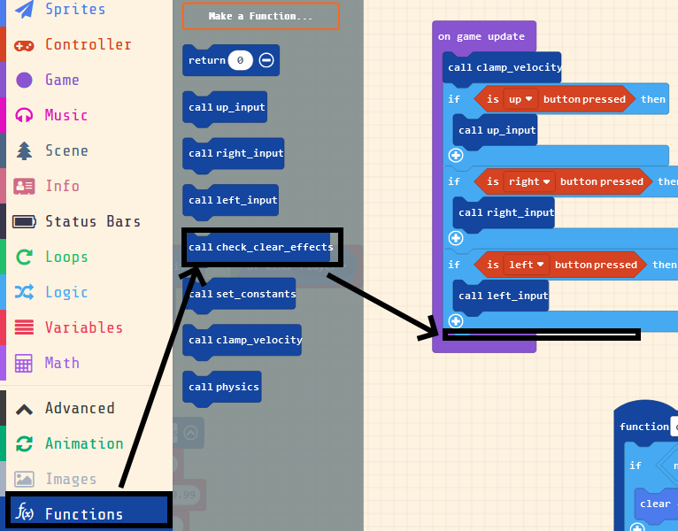
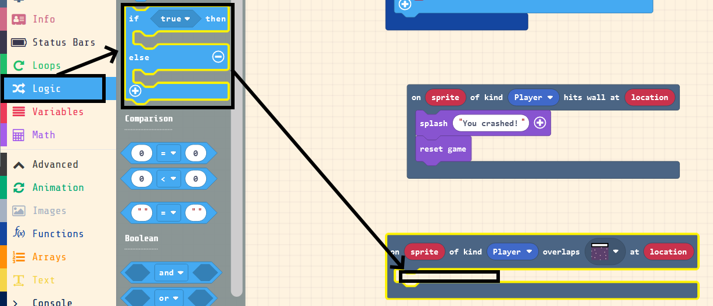

## What is Engineering - Winter 2021

# SSE Lab: Lander in MakeCode Arcade

### University of Regina
### Faculty of Engineering and Applied Science - Software Systems Engineering

### Lab Instructor: [Adam Tilson](mailto:Adam.Tilson@uregina.ca)

---

## Introduction

In this lab we will be using Microsoft MakeCode Arcade to make a Lunar Lander type game. This variation on a 1979 Atari arcade game has the player attempt to land a space probe on the moon by locating the goal and then very slowly maneuvering the lander into the landing zone so that it is not destroyed. Movement is tricky since it is based on physics which relys on rotation, thrusters and gravity. We will deviate from the original in that we will not use rotation, and instead have horizontal and vertical thrusters, which work better with the 2D pixel nature of the engine.

## Getting started...

Head to Microsoft [MakeCode Arcade](https://arcade.makecode.com/).

You can find the starter code embedded in this image...

And the final code embedded in this image...

MakeCode Arcade saves projects as image files. Weird, I know. Simply save the image file to your computer, and then drag and drop it into MakeCode to load up the project. Cool! We will work together from the starter code to get to the end code!

## What's already been done...

I've added several useful functions that I think are too tedious for you to code yourself. I've also left various snippets of code laying around the project for you to drag and drop into place. These are particularly tricky blocks with which you might have a higher chance of making a mistake.

I've also added some constants. These are like system parameters for the game, and control the general rules. You can modify these to change game behaviour, and make it easier or harder.

I've loaded in a sprite and a level, so that we can all have the same starting files, but you can modify these to your liking.

The code is presented in `blocks`. MakeCode, in addition to supporting JavaScript and Python for more experienced programmers, uses Blocks for beginners. In Blocks, a line of code, or programming rule, is represented as a block object which can be dragged and dropped, and sometimes parts of it may be further modified. These blocks follow the same programming rules as code, but they are more beginner friendly. For this reason, we will be working with blocks.

The starting state of the project, in code blocks, is...

Before we get too far, a few high level programming concepts to understand:

- Your code begins executing from an "entry point", and then executes instructions in order until complete
    - The order of your statements matter! Statements which rely on earlier statements must come later
    - For example, you must create an object before you try to use it, or you will get a `null` object error
- In game development, the two common entry points are when the game starts up, (`on start`) and at regular intervals during play (`on game update`).
    - Alternate entry points are called "callbacks" and happen when certain events in the game occur
- Sometimes you will want code to run only in certain situations, which can be guarded against using `if` blocks
    - we can also run code if in the opposite condition using the `else` part of if blocks.
- Code which will be frequently reused should be nested in functions, which group together code that serves similar purposes

## Testing our game

Every line of code we write, our game will compile and run in the simulator on the left.

## What we need to do...

Not much is happening in our game work just yet, we just have some simple assets loaded. We need to add the ability to control our lander, add some gravity, add physics, make a level, add collisions, handle winning and losing conditions, add a gas tank, and beautify our project. We've got a lot to do!

### Handle user input

Let's start by allowing the user input to be read in the game. We'll use a simple, inefficient, way of checking for input called "polling", in which we check each game update to see if a button is pressed...

Let's add an `if` block to the `on_game_update` function

Now we need to add the particular condition we are looking for to this if statement...

Let's change the button to "up" 

Now any code inside of this `if` block will run every game update that the up button is pressed. For now, let's just call a function here...

Finally, we need to call this function. 

Now, whatever we put inside of this function will get called any frame that the up arrow is pressed. Cool! 

Challenge 1: Repeat this for the `left` and `right` keys. Name appropriate functions for them as well!

Once complete, your update block should look like...

How can we test if our input is working? Let's add a `spray` effect to our player when any button is pressed...

Make sure the effect applies to your ship...

Copy this effect to the other buttons as well...

Finally, all of the buttons are released, we want to turn off the effect. In other words, we want to check if `up is not pressed`, and `left is not pressed`, and `right is not pressed`. This is an example of combinational logic. As this is a lengthy if-statement check, I've already given you part of the code, you just need to finish it off, nest it into a function, and call the function.

We are at a point where we can test our function. If you press any of the buttons up, left or right the ship will play an effect. If you release all of the buttons, the effect should stop.

### A bit of physics

To actually fly our ship around, we need to learn a bit about the game world and the physics. The game world is 160 x 160 pixels. The vertical axis is called 'y', the horizontal, 'x'. The origin is in the upper left. We can move our ship by applying a velocity in either the x or y direction. Positive values move down and right, negatives values move up and left.

Let's start by adding gravity.

Open up the `physics` function, which is provided, and drag in the code block for gravity, also provided. I've included a value for gravity which I thinks works well with the game, which is stored in the constants function.

Be sure to also call `physics` in the game update function!

If you test your code now, your ship should fall right down and through the bottom of the screen! We'll fix that in the next section.

Finally, let's add the ability to move our space ship using up, left and right inputs. I've provided code blocks for this, they just need to be dragged into the correct slot.

Challenge 2: Using the world axes shown above, figure out which of the three velocity adjustment statements go with which input function. Solution below, so don't peek!

Slot in your solution, and test it out. Do your controls do what you expect? Can you keep your ship in the frame?

Solution:

### Making a level

Just having our ship float around a black box is pretty boring. Let's see if we can improve it...

Let's start by adding a starry background effect...

In game design, we conceptualize the game screen as a camera looking at the player. We want the camera to follow the ship, so that we can see where it is in the larger world...

Now you will see your ship fall... right into the world map below. Cool! Speaking of which, our world is kind of boring, isn't it? It's time to change that. You can change your ship too while we are at it...

To change the ship sprite, click on...

Which will open the sprite editor. You can use the colors and tools on the left to draw on your sprite. I personally dig the green triangle which reminds me of Atari quadriscan, but to each their own!

You can even use a pre generated sprite by clicking on gallery.

Once you are happy with your ship, let's edit the world...

Design a world you think would be fun. Using the "dungeon" tileset you can add some tiles that work with our theme. 

I have also added some custom tiles which you can use here. The white squares are the goal - this is where we want to land our lander. I also have some hint tiles, ->, <- and SLOW. I recommend putting these slightly under the ground so that you can guide the player to the goal! Also, be sure to include at least one goal square! Finally, playtest your game to make sure your player doesn't start in a wall! 

Challenge 3: Make a level!

Here is an example level I've created...

The tiles we have created are purely art right now, we need to also give them purpose in the game. You can signify to your game that your tiles are walls by painting them with wall paint. Be sure not to paint the goal tiles though! Any tile painted with the wall paint will cause your ship to crash if it touches it... once we add some code for this!

When you test your game, you will see that your player now is in a much more interesting world... but still falls through the ground. Let's fix that next!

### Handle collisions

So far our code has always started from the `on start` or the `on game update` functions. But we can also have code run if something specific happens in the game, like a player colling with a wall tile we just added. Let's create a code block to test for this...

When the user collides with the wall, we want to notify the player what happened...

Type an appropriate message...

And give them another chance for success...

Test out your game. Are you crashing? If not, you may not have painted wall paint on all of the edges.

### Handle winning

Now. let's give our player a chance to succeed, by adding some win conditions. We need to see that the player has collided with the goal tile...

Set this to the goal tile...

Now, we only want the player to win if they are going slow enough. Let's add an if / else block...

We want to check if one variable, v_y is less than a constant, MAX_WIN_V_Y. First we'll add the compartor block...

Let's set the first part of the comparison to the variable v_y, and the second part of the comparison to the constant MAX_WIN_V_Y.

Finally, if the player wins, we can play the win screen...

Be sure to set the state to `win`

But if they were going too fast and crashed, we need to tell them why, and reset the game.

Test it out. If you are unhappy with the speed for safe landing, you can experiment by changing it in the constants. 

We have a working game! Cool! The next bonus section allows us to make the game harder by adding a limited amount of fuel. Once this fuel runs out, the player can no longer move. This means the player must move cautiously. Also, if the player lands safely, the remaining fuel can be used as a high score metric, so that on replays the player can try to save more fuel!

### Adding some fuel

This section is meant to be less guided, so you may need to look around to find some of these functions. Big hint - check out the `Status Bars` section.

First, let's attach an energy bar to the player in `on game start`...

Next, we want to decrease the fuel whenever the player moves...

Make sure this is included everywhere the thrusters are active!

Speaking of which, once we run out of fuel, we want to disable movement. We can check if we still have fuel with...

We should use this guard to only allow the user to activate the thursters if there is fuel remaining.

Where should this go?

We can also turn off the thruster effects if the user has run out of fuel with...

Finally, if the user lands safely, we wish to notify them how much fuel they have left. This acts as a high score.

This is a crazy long blong, so it's included in the starter code:

And that's it! You now have a more challenging game, in which you can improve with each play.

## Where to go from here...

You could try adding different levels to the game.

Play with the constants and see if you can find a more satisfying gameplay experience, or additional challenge.

I hope you have enjoyed this lab!